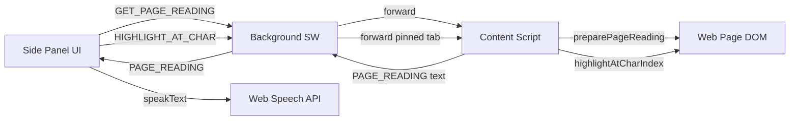

# Architecture

## Overview

Geordi is a Manifest V3 browser extension built with WXT. It runs three isolated contexts that communicate via `chrome.runtime.sendMessage`.

## Extension contexts

| Context | Entrypoint | Role |
|---|---|---|
| Background | `entrypoints/background.ts` | Side panel registration, keyboard shortcut, message relay, reading-tab pinning |
| Content | `entrypoints/content.ts` | DOM wrapping, charIndex highlighting |
| Side panel | `entrypoints/sidepanel/` | User controls, TTS playback, settings |

## Modules

| Module | Path | Purpose |
|---|---|---|
| Content extraction | `lib/content/extract.ts` | DOM text extraction, boilerplate/form-control skip rules |
| Page reading prep | `lib/content/prepare-reading.ts` | Wrap page/selection for TTS + highlight alignment |
| DOM wrapping | `lib/content/wrap-for-reading.ts` | Word/sentence spans, charIndex highlight walk |
| Deep DOM | `lib/content/deep-dom.ts` | Shadow-root traversal, subtree checks |
| Range mapping | `lib/content/range-map.ts` | Stream offsets → live DOM Ranges (legacy path) |
| Highlight | `lib/content/highlight.ts` | CSS Highlight API helpers (legacy path) |
| Contrast | `lib/content/contrast.ts` | WCAG contrast helpers (not yet wired to live highlights) |
| Speech reader | `lib/speech/reader.ts` | Web Speech API, `speakText()` + `speakSentences()` |
| Messages | `lib/messages.ts` | Typed message contracts between contexts |
| AI provider | `lib/ai/provider.ts` | Stub for Phase 3 BYOK/paid features |

## Message flow: Read page

1. User clicks "Read page" in side panel
2. Side panel sends `{ type: "GET_PAGE_READING" }` to background
3. Background forwards to content script in active tab; stores tab id as `readingTabId`
4. Content script runs `preparePageReading()` — wraps readable text in word spans (skips buttons/form controls and nav), returns `{ type: "PAGE_READING", text, title }`
5. Side panel calls `SpeechReader.speakText(text)` — one `SpeechSynthesisUtterance` for the full passage
6. On each word `boundary` event, side panel sends `{ type: "HIGHLIGHT_AT_CHAR", charIndex }`; background forwards to pinned tab; content script highlights sentence + word and scrolls
7. On pause, side panel sends `{ type: "CLEAR_HIGHLIGHT" }` (styles only; DOM wraps remain for resume)
8. On stop/end, side panel sends `{ type: "CLEAR_HIGHLIGHT" }` then `{ type: "TEARDOWN_READING" }` to unwrap spans

## Storage

User preferences (voice, speed) stored in `chrome.storage.local` under key `geordi:speech-settings`.

## Free vs paid boundary

Core reading path uses only DOM APIs and Web Speech API — no network. AI module (`lib/ai/`) is stubbed until Phase 3.
