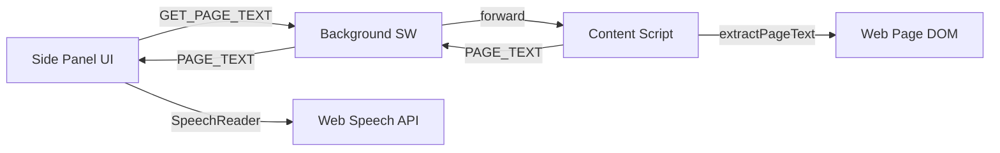

# Architecture

## Overview

Geordi is a Manifest V3 browser extension built with WXT. It runs three isolated contexts that communicate via `chrome.runtime.sendMessage`.

## Extension contexts

| Context | Entrypoint | Role |
|---|---|---|
| Background | `entrypoints/background.ts` | Side panel registration, keyboard shortcut, message relay |
| Content | `entrypoints/content.ts` | DOM access — extract page/selection text |
| Side panel | `entrypoints/sidepanel/` | User controls, TTS playback, settings |

## Modules

| Module | Path | Purpose |
|---|---|---|
| Content extraction | `lib/content/extract.ts` | DOM → plain text for TTS |
| Speech reader | `lib/speech/reader.ts` | Web Speech API queue, pause/resume, settings |
| Messages | `lib/messages.ts` | Typed message contracts between contexts |
| AI provider | `lib/ai/provider.ts` | Stub for Phase 3 BYOK/paid features |

## Message flow: Read page

1. User clicks "Read page" in side panel
2. Side panel sends `{ type: "GET_PAGE_TEXT" }` to background
3. Background forwards to content script in active tab
4. Content script runs `extractPageText()`, returns `{ type: "PAGE_TEXT", text, title }`
5. Side panel splits text into paragraphs, feeds to `SpeechReader`
6. `SpeechReader` speaks via `speechSynthesis`, emits status events to UI live region

## Storage

User preferences (voice, speed) stored in `chrome.storage.local` under key `geordi:speech-settings`.

## Free vs paid boundary

Core reading path uses only DOM APIs and Web Speech API — no network. AI module (`lib/ai/`) is stubbed until Phase 3.
